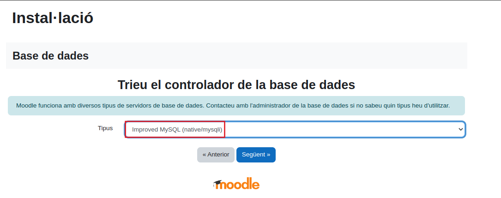

# Guia d'instalació Moodle

## Abans de començar:
Abans de començar amb l'instal·lació del Moodle, hem d'instal·lar unes eines.
Necesitarem:
- Ubuntu server amb ssh
- apache2
- unzip
- MariaDB

### Ubuntu server amb ssh
A l'instal·lació del Ubuntu server, haurem d'instal·lar el servei "ssh"


### Instalació unzip
Descarregarem l'eina "unzip" per descomprimir un arxiu que veurem més endavant.
```sh
sudo apt install unzip
```


### Instalació apache2
Un cop tenim la màquina virtual creada, ens descarregarem el
"apache2"
```sh
sudo apt install apache2
```


### Instalació MariaDB
Ara descarregarem la base de dades "MariaDB" amb la següent comanda:
```sh
sudo apt-get install mariadb-server
```


Seguidament, executarem la seguretat del servidor MariaDB i la configurarem.
```sh
sudo apt-get install mariadb-server
```


### Instalació PHP
I per últim descarregarem el PHP, el meu cas he descarregat la versió 7.3, ja que és la compatible amb la versió de Moodle que jo tinc.
```sh
sudo apt-get install php7.3 -y
```
```sh
sudo apt install libapache2-mod-php7.3
```
Un cop el tenim instal·lat reiniciarem el servei "apache2" perquè es desin tots els canvis.
```sh
sudo service apache2 restart
```
Ara comprovarem si el servei "apache2" funciona correctament amb la seguent comanda:
```sh
sudo service apache2 status
```


### Instalació Moodle
Un cop ja tenim totes aquestes eines, ens dirigirem a moodle.org, a l'apartat de "Downloads"


Ens descargarem la ultima versio disponible, la 4.0.5.


Se'ns baixara un document automàticament, però només ens interessa l'enllaç de la baixada. Ens sortirà un missatge on ens indica que si no s'ens ha baixat res fes clic a aquest enllaç i torneu a provar, però nosaltres farem clic dret a sobre d'aquest enllaç i el copiarem.


Un cop hem obtingut l'enllaç de la descarrega, obrirem la màquina virtual i executarem la seguent comanda amb el link:
 ```sh
wget https://download.moodle.org/download.php/stable400/moodle-latest-400.zip
```

Descomprimirem l'arxiu zip i el rediccionarem al directori /var/www/html/
 ```sh
sudo unzip moodle-latest-400.zip -d /var/www/html/
```


Cambiarem el propietari del directori.
 ```sh
sudo chown www-data:www-data /var/www/html/moodle
```


Un cop hem fet aixo tornarem a reiniciar el servei "apache2" i provarem d'accedir al Moodle pel nostre navegador.
```sh
sudo service apache2 restart
```


Seleccionarem l'idioma de la instalació del moodle, en el meu cas he seleccionat el catala.


Ara ens indicara que falten dos moduls de PHP: curl i zip.


Per solucionar aquest problema executarem les seguents comandes:
```sh
sudo apt install php7.3-curl
```


```sh
sudo apt install php7.3-zip
```


Despres d'executar aquestes comandes reiniciarem el servei apache.
```sh
sudo service apache2 restart
```

Li donarem a F5 i refrescarem la pagina, i podrem veure que ja podrem seguir.


Canviarem el direcori de dades per un directori que previament haviem creat "/home/moodledata"


Quan li donarem a seguent, ens demanara quin controlador de base de dades usarem, en el nostre cas hem instalat MariaDB.


A la pàgina següent preguntaran l'adreça de la base de dades: "localhost", el nom de la base de dades: "moodle", l'usuari: "moodlemanager" i la contrasenya: "managermoodle", la resta de camps els podem deixar tal com estan.


Pero ens donara un error ja faltes unes eines que hem d'instalar.


Archiu XML
```sh
sudo apt install php7.3-xml
```


Archiu MBSTRING
```sh
sudo apt install php7.3-mbstring
```


Archiu GD
```sh
sudo apt install php7.3-GD
```


Archiu INTL
```sh
sudo apt install php7.3-intl
```


Archiu XMLRPC
```sh
sudo apt install php7.3-xmlrpc
```


Archiu SOAP
```sh
sudo apt install php7.3-soap
```


Un cop hem instalat tots aquests archius, reiniciarem el servei apache.
```sh
sudo service apache2 restart
```

Recargarem la pagina i ens sortiran les condicions de moodle, les aceptarem.


Seguidament ens mostrara les comprovacions del servidor, li donarem a continuar.


Ara ens sortiran els logs que tenim al servidor.


Seguidament actualitzarem el nostre perfil.


També hem de configurar els paràmetres de la pàgina de Moodle amb algunes descripcions:


I ja tindriem acces al nostre curs de moodle


