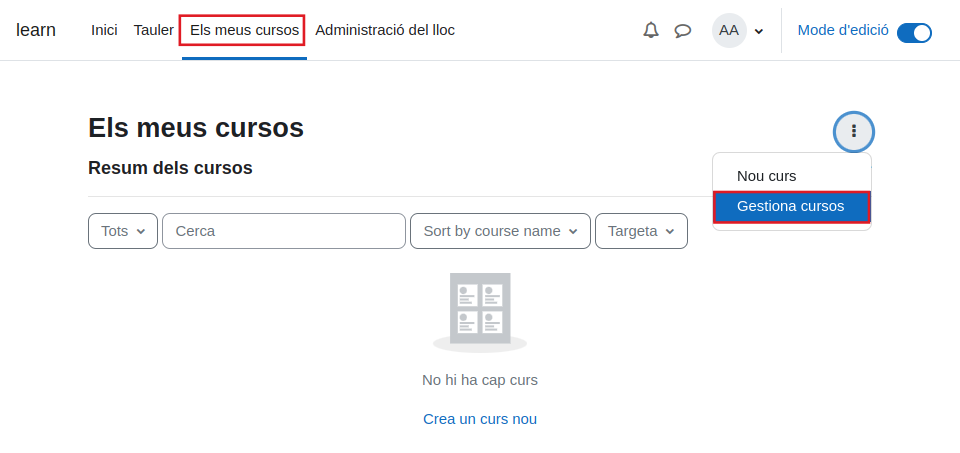
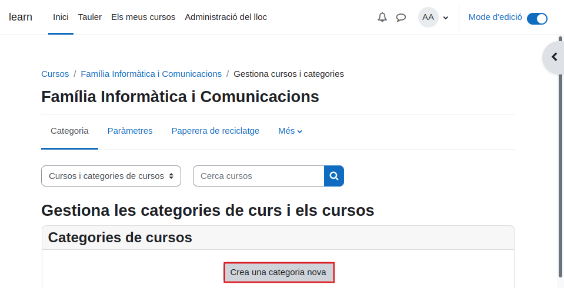
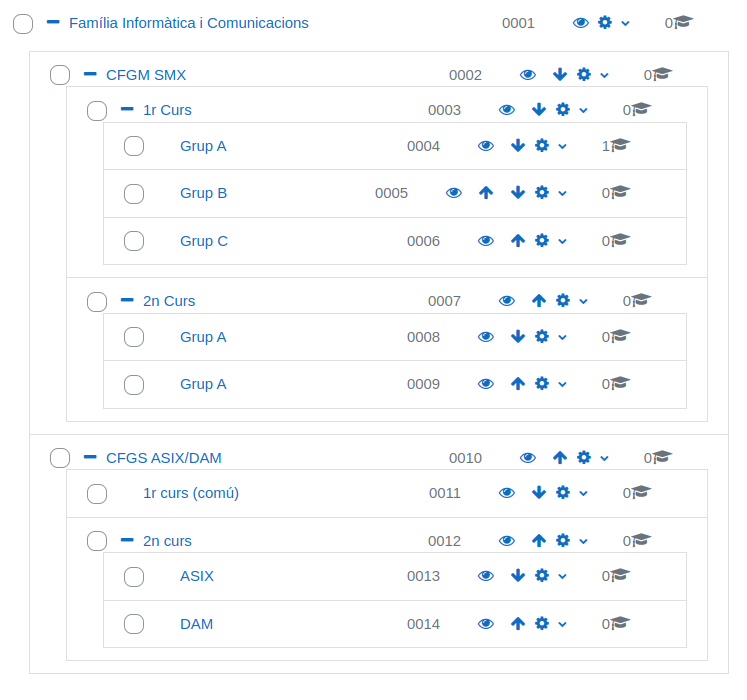
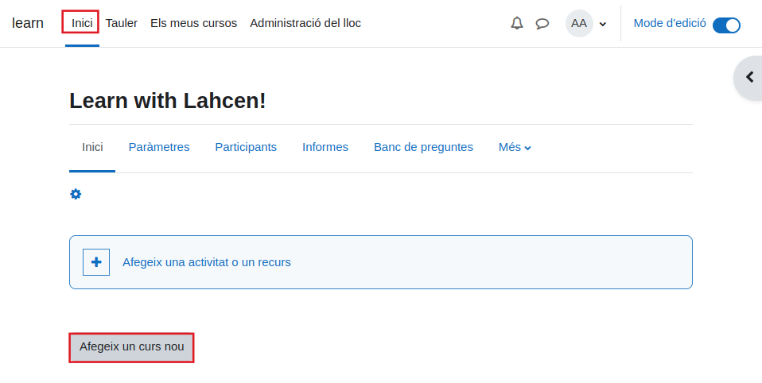
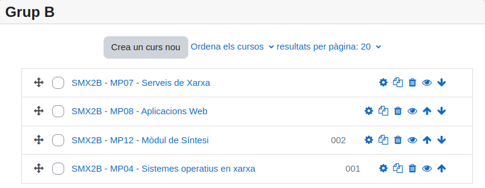
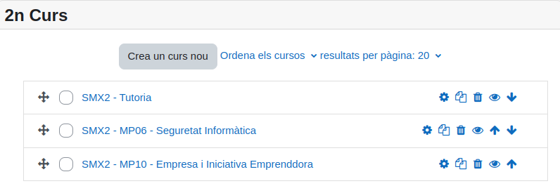

# Creació de cursos
Ens dirigirem a "Els meus cursos" on li donarem als tres puntets i seleccionarem l'opció "Gestiona cursos"

Ens sortirà un opció anomenada "Crea una categoria nova" que ens deixarà crear categories.

Aquí anirem creen categories i subcategories fins que ens quedi així.

Un cop creades totes les categories i les subcategories, començarem a crear els cursos.

Per crear els cursos ens dirigirem a "Inici" i ens sortirà l'opció de crear un nou curs.

Crearem els cursos i li assignarem la categoria, en aquest cas el grup B de 2n d'SMX.

Ens quedarien així:

