# Personalització del perfil:
1. Entra a un usuari de Moodle i personalitza el seu perfil amb una imatge.

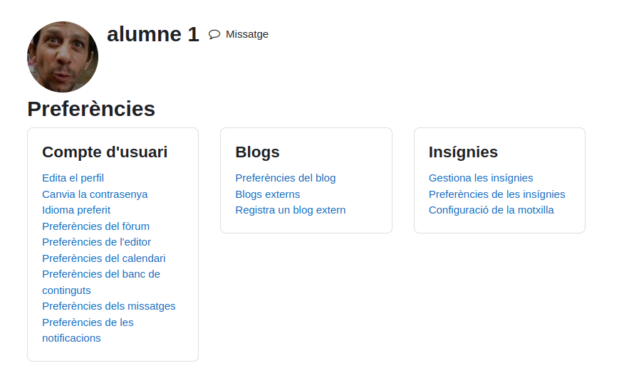

2. Canvia la seva contrasenya.

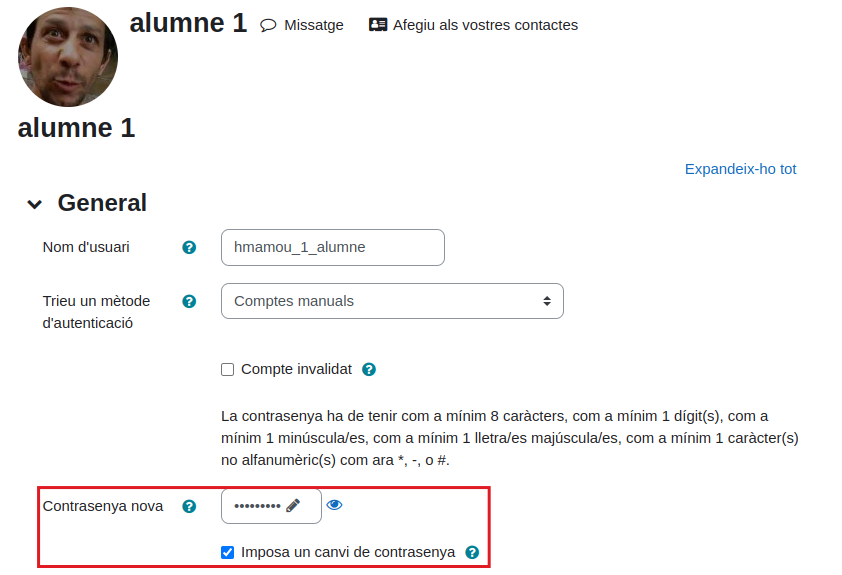

3. Canvia el seu idioma preferit a anglès.

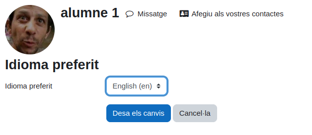

4. Oculta el seu mail a usuaris sense permisos.
5. Canvia el primer dia de la setmana del calendari a Diumenge.

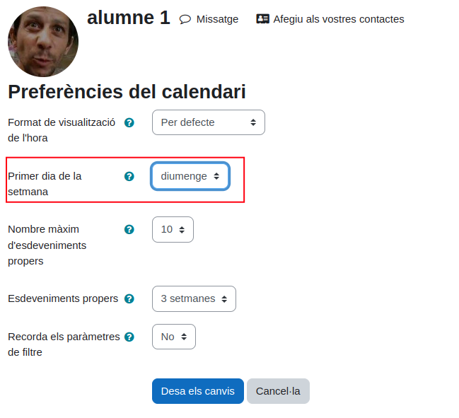

6. Fes que només els contactes de l'usuari puguin enviar-li missatges.

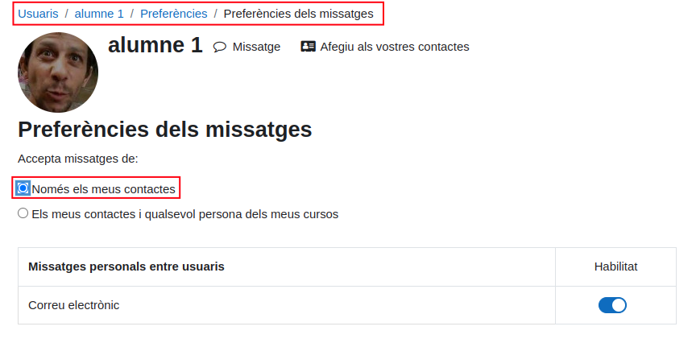

# Cursos
1. Crea un Curs nou anomenat "Programació amb Python" dins de la 
categoria 2n curs -> DAM.

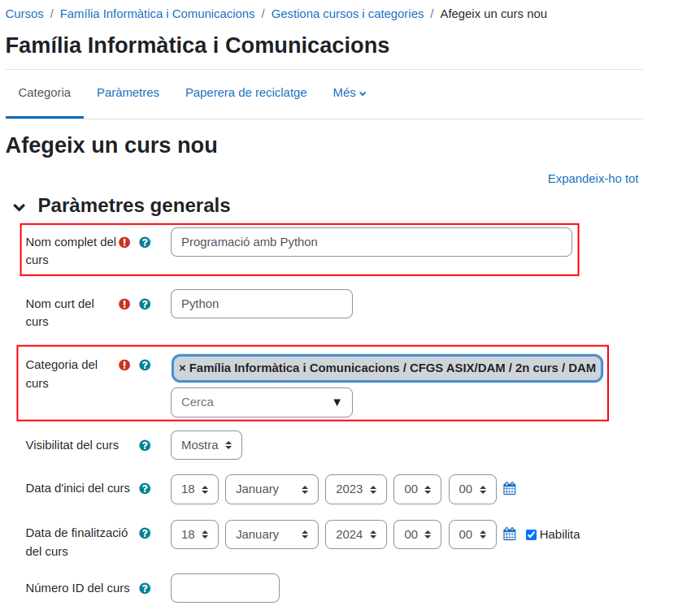

2. Inscriu a tots els alumnes al curs.

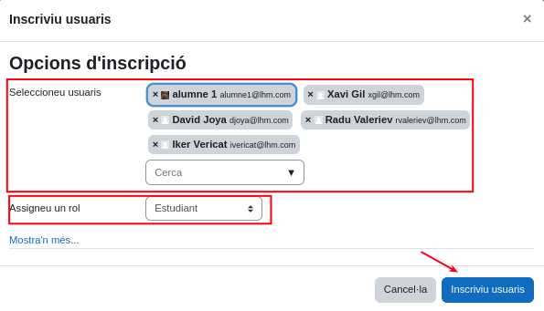

3. Inscriu a tots els professors al curs.

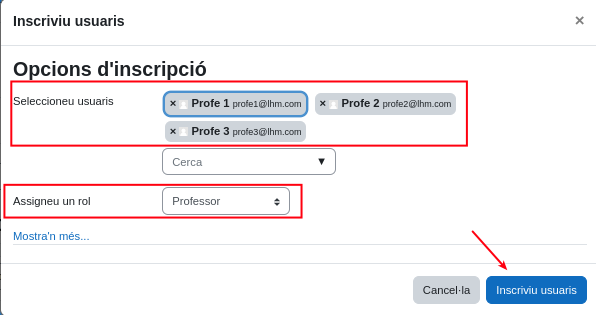

4. Crea un fòrum general de dubtes (el d'anuncis no serveix).

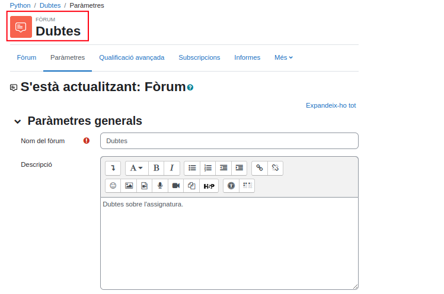

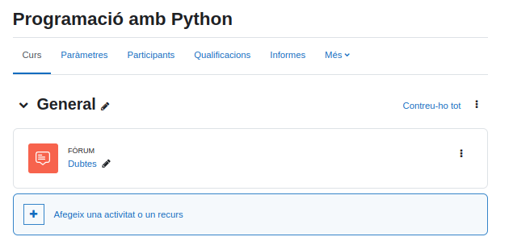

5. Fes que dos estudiants fassin consultes al fòrum.

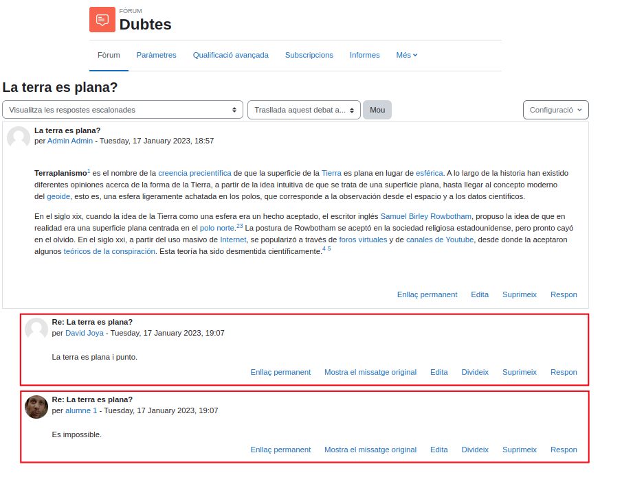

6. Contesta les preguntes amb un perfil de professor.

7. Crea un tema anomenat "Fonaments de Python".

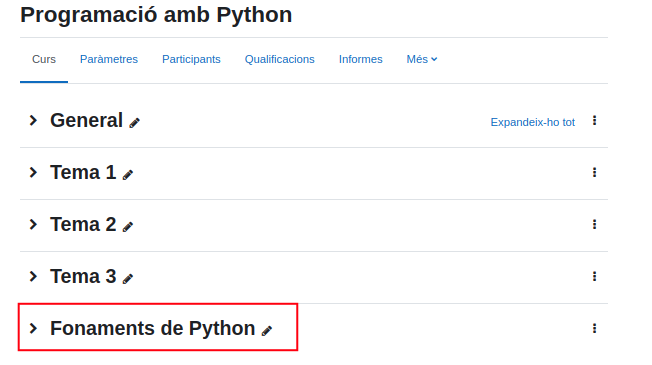

8. Oculta la resta de temes del curs.

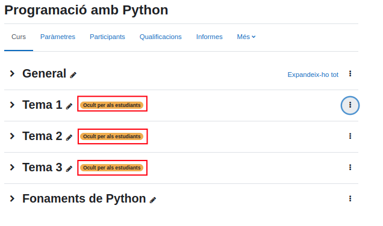

9. Dins del tema crea una tasca anomenada prova inicial amb 10 preguntes molt bàsiques sobre Python. 

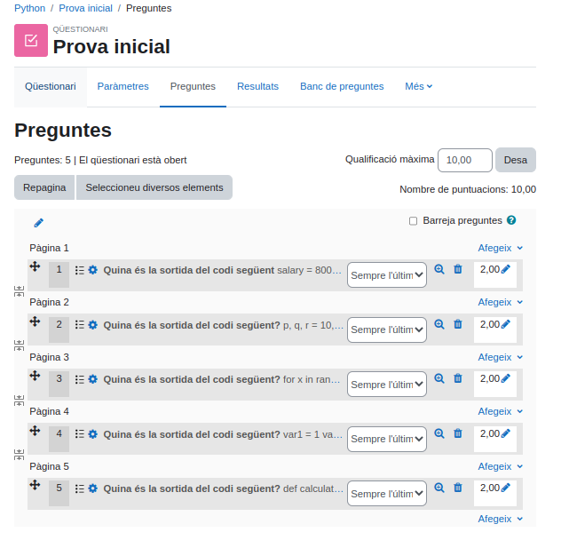

10. Fes que els alumnes contestin la tasca (mínim 3).
11. Qualifica la tasca de l'alumnat.
12. Mostra les qualificacions de l'alumnat.

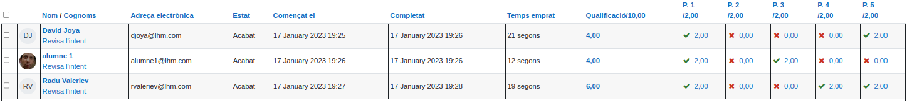

13. Com a perfil d'alumne mostra la teva qualificació.

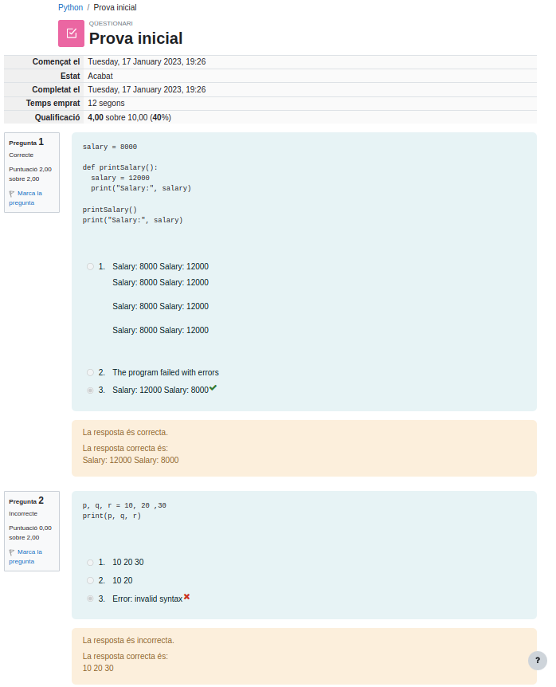

14. Crea una activitat de consulta amb una pregunta sobre què costa més a l'alumnat sobre el tema del curs amb 4 opcions.

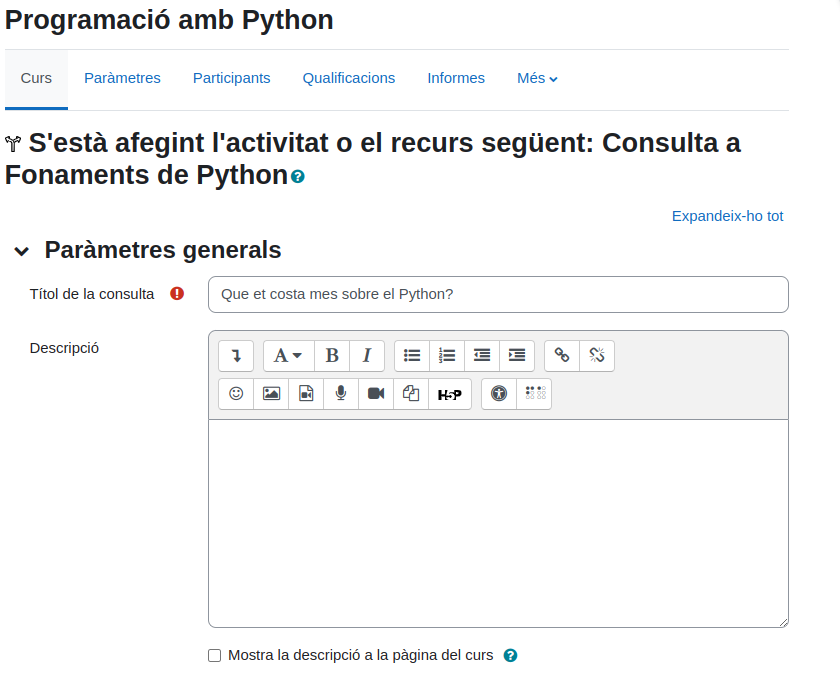

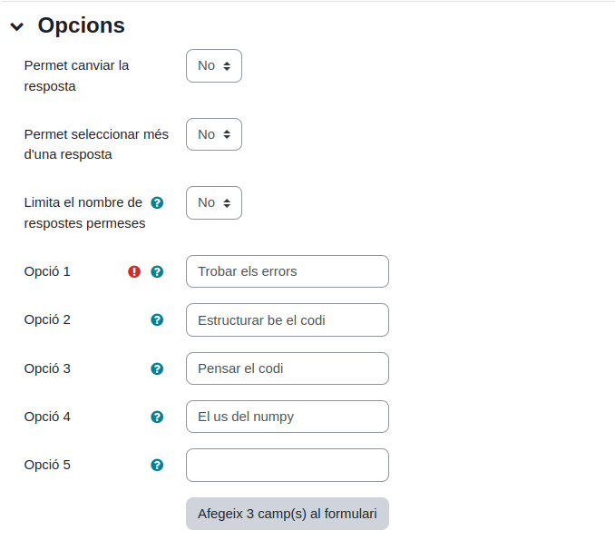

15. Com a alumne/a contesta la consulta.

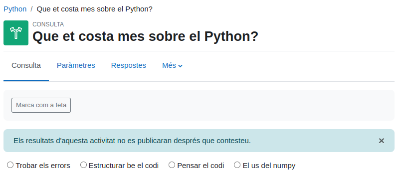

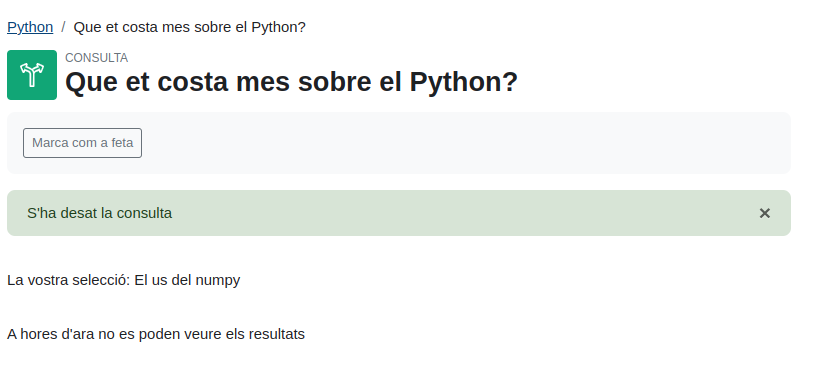

16. Com a professor mostra les contestacions de la consulta.

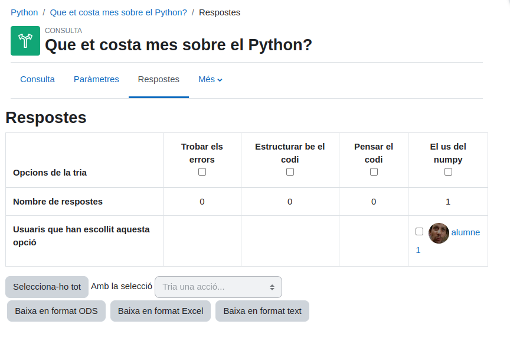
